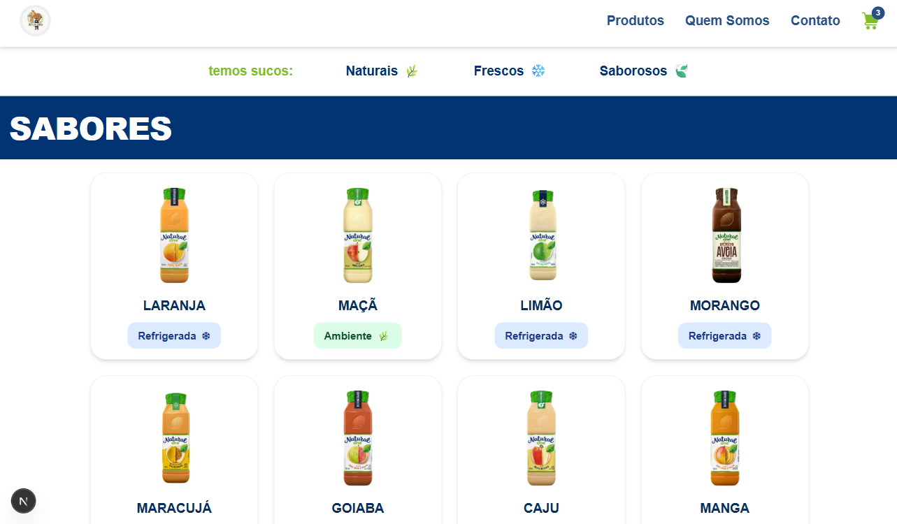
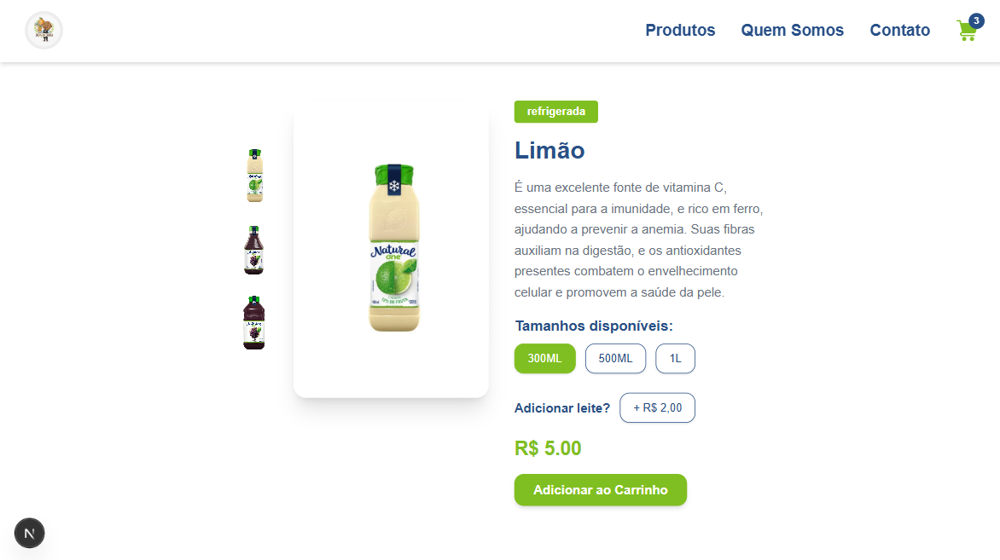
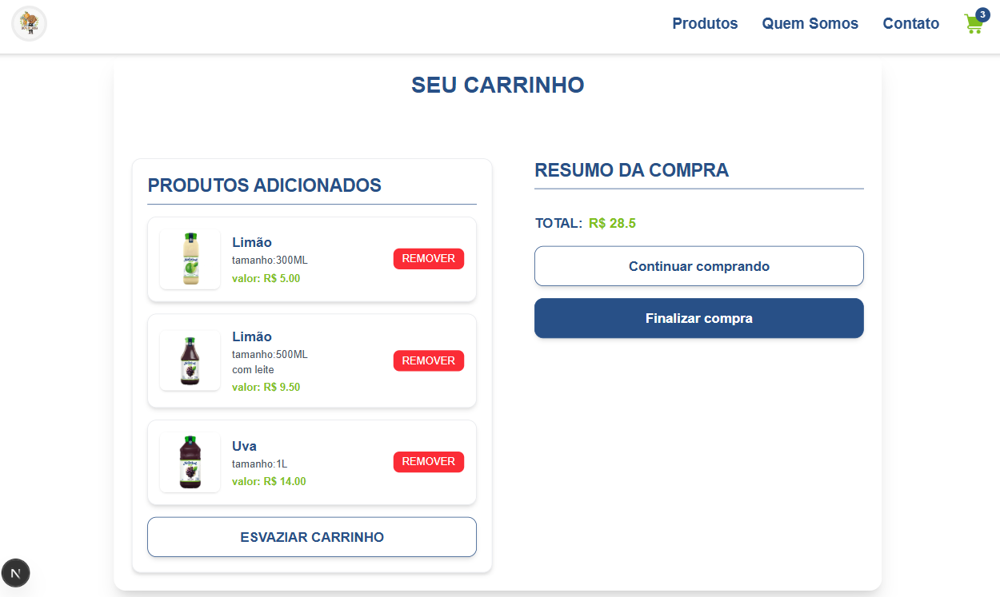

# 🥤 Sucos do Careca

> Site oficial para pedidos de sucos naturais, com foco em simplicidade, rapidez e integração via WhatsApp.

---

## 📌 Visão Geral

O **Sucos do Careca** é um projeto web desenvolvido para permitir que clientes realizem pedidos de sucos de forma rápida, sem necessidade de login, enviando o pedido diretamente via WhatsApp.

Este projeto foi pensado inicialmente como um **MVP (Produto Mínimo Viável)**, com arquitetura simples, porém organizada, permitindo fácil evolução no futuro.

## 📸 Screenshots

<div align="center">
    
    
    
</div>

---


## 🎯 Objetivo do Projeto

* Facilitar pedidos de sucos naturais
* Reduzir fricção no processo de compra
* Enviar pedidos diretamente pelo WhatsApp
* Estrutura preparada para futuras integrações (API, backend, login, etc.)

---

## 🧩 Funcionalidades Atuais

* Listagem de produtos (sucos)
* Carrinho de compras
* Formulário simples para dados do cliente
* Validação de formulário no front-end
* Geração automática da mensagem de pedido
* Envio do pedido via WhatsApp

---

## 🛠️ Tecnologias Utilizadas

* React
* Next.js
* TypeScript
* Context API
* Tailwind CSS

---

## 🗂️ Estrutura do Projeto (resumo)

```
src/
 ├─ components/     # Componentes reutilizáveis
 ├─ contexts/       # Contextos globais (ex: carrinho)
 ├─ pages/          # Páginas da aplicação
 ├─ services/       # Regras de negócio e integrações futuras
 ├─ types/          # Tipagens TypeScript
```

---

## 📦 Fluxo de Pedido (atual)

1. Cliente escolhe os produtos
2. Adiciona ao carrinho
3. Preenche nome, telefone e endereço
4. Sistema valida os dados
5. Pedido é formatado
6. WhatsApp é aberto com a mensagem pronta

---

## 🚀 Possíveis Evoluções Futuras

* Cálculo automático de taxa de entrega por distância
* Integração com API de mapas
* Backend para persistência de pedidos
* Área administrativa
* Sistema de login (opcional)
* Histórico de pedidos

---

## ⚠️ Observações Importantes

* Atualmente, todas as validações ocorrem no front-end
* O projeto não utiliza backend nesta fase
* Ideal para pequenos negócios ou MVPs

---

## 👨‍💻 Desenvolvedor

Projeto desenvolvido por **Mateus**.

> Este README será atualizado conforme o projeto evoluir.
